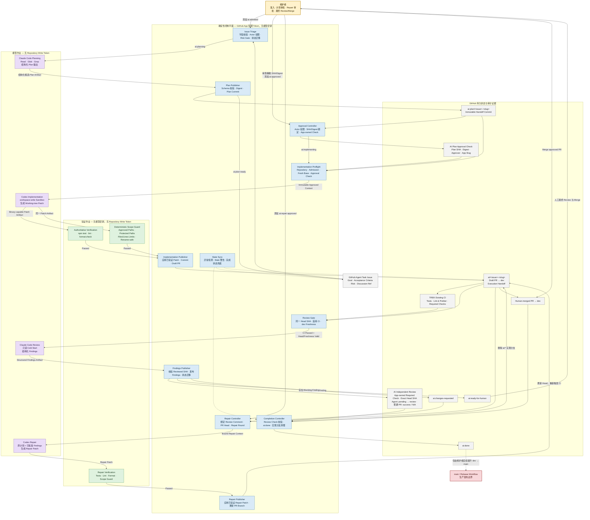

# Agent 工作流程架构图

本文展示 TREK 从 GitHub Issue 准入、计划审批、Codex 实现、Claude 独立审查，到人工合并 `dev` 的完整 Agent 工作流程及其权限边界。

## 权限边界图例

| 区域 | 可用凭据 | 允许的主要操作 | 明确禁止 |
|---|---|---|---|
| 人类维护者 | GitHub 人类账户 | 准入、审批、最终 Review、Merge、发布提升 | Agent 代替人工批准 |
| 模型作业 | 对应模型 API 凭据 | 读取仓库、生成结构化输出或 Patch | Repository write token、状态迁移、Push、PR、Release |
| 验证作业 | 无模型密钥、无写 Token | 应用 Patch、执行测试、Scope Guard | 发布或修改 GitHub 状态 |
| 确定性控制器 | 短期 GitHub App token | 校验授权、提交已验证内容、创建 PR、迁移状态 | 执行生成代码、持有模型密钥、自动 Merge/Release |

## 核心安全不变量

1. 人工批准绑定精确的 Plan commit SHA 和规范化内容 digest。
2. 模型进程不能直接修改 GitHub 持久状态。
3. 测试进程拿不到模型密钥和仓库写凭据。
4. Publisher 只消费已通过 verification 与 scope guard 的 Patch，不执行生成代码。
5. Review findings 只对其记录的 PR head SHA 有效；Head 变化后必须重新 CI 和 Review。
6. Agent 流程止于 `dev` 的 Draft PR；`main` 与生产发布始终属于人工边界。
7. `dev` ruleset 必须要求由配置 App 创建的 `AI Independent Review` Check；Issue label 不是 Merge 门禁。
8. Handoff 是 Review 前的不可变实现快照；最终 Review、Merge 与完成证据位于 App Check、PR 评论和 Issue 完成评论。
9. Merge 后事件控制器立即收敛为 `ai:done` 并删除 `ai/*` 实现分支；`ai-plan/*` 按 policy 保留，State Sync 仅作兜底。
